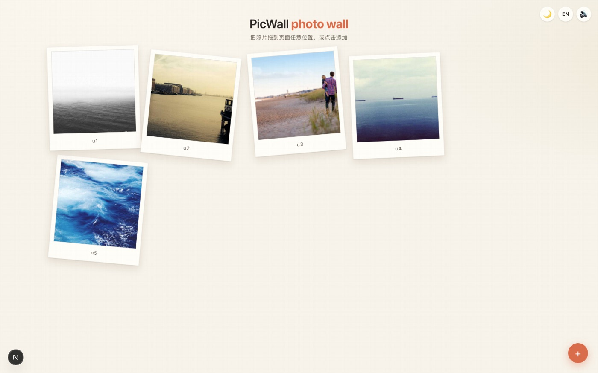

<p align="center">
  
</p>

<p align="center">
  <b>本地拍立得照片墙</b> — 拖照片进网页，自动存本地，渲染成可点击、可放大、随机旋转分层的拍立得散落墙。
</p>

<p align="center">
  
  
  
  
  
  
</p>

<p align="center">
  <code>零数据库</code> · <code>零外部依赖</code> · <code>单命令启动</code>
</p>

---

## 截图

<p align="center">
  
</p>

## 这是什么

一个本地优先的拍立得照片墙：把任意照片拖进网页 → 自动存入 `uploads/` → 页面立即渲染为**随机旋转、z-index 分层**的拍立得散落布局。所有数据都在你的磁盘上，不上传任何服务器。

## 为什么这样设计

| 特性 | 说明 |
|---|---|
| **零依赖** | 仅 next/react/react-dom，无数据库、无对象存储、无外部 API |
| **隐私第一** | 照片只存本地 `uploads/`，GET 接口不暴露原始文件名 |
| **拍立得质感** | 纸纹噪点 + 随机旋转 + 分层 z-index + hover 放大 |
| **键盘可达** | Tab 聚焦 → Enter 打开大图，Esc 关闭 |
| **动作音效** | 每个操作匹配独立 cuelume 音效（打开/关闭/删除/上传） |
| **自适应布局** | masonry 排布，卡片高度随照片比例，无留白 |

## 快速开始

```bash
npm install
npm run dev
```

打开 <http://localhost:3000> ，把照片拖进页面，或点右下角 `+`。

生产模式：`npm run build && npm start`（Node ≥ 18.18，见 `.nvmrc`）。

## 存储结构

```text
uploads/           # 上传的照片（按 id 命名，如 5aeb779cd258.jpg）
manifest.json      # 照片元数据（id/path/title/desc/uploaded_at）
```

两者均为运行时数据，已 gitignore，不入库。可通过环境变量覆盖存储位置：

```bash
PICWALL_DATA_DIR=/data/photos PICWALL_MANIFEST=/data/manifest.json npm run dev
```

## API

| 方法 | 路径 | 说明 |
|---|---|---|
| `GET` | `/api/images` | 照片列表（剔除原始文件名，保护隐私） |
| `POST` | `/api/images` | 上传（multipart 字段 `files`，≤20MB/张，白名单 jpg/png/gif/webp/bmp，魔数嗅探防伪造） |
| `DELETE` | `/api/images/:id` | 删除照片与元数据 |

## 测试

```bash
npm test          # vitest：40 单测，覆盖率 100%（四指标门禁）
npx playwright test  # E2E：5 条全流程（加载/上传/lightbox/键盘/删除）
```

CI 自动跑全部：typecheck → 单测+覆盖率 → build → E2E。

## 技术栈

Next.js 16 (App Router) · React 19 · TypeScript strict · vitest · Playwright

## 治理

[CHANGELOG](CHANGELOG.md) · [CONTRIBUTING](CONTRIBUTING.md) · [SECURITY](SECURITY.md) · [License](LICENSE) · [Dependabot](.github/dependabot.yml)
