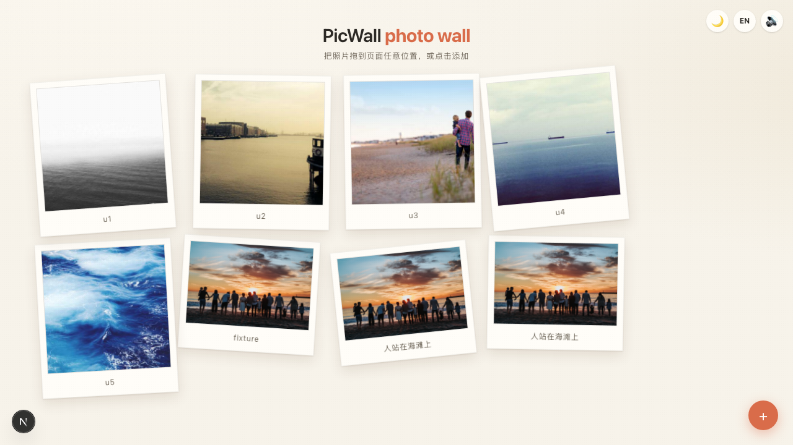
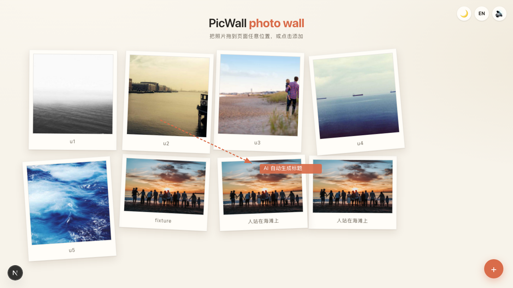

# PicWall 使用手册

> 本文档由 **Playwright 自动驱动真实应用** 生成 — 截图来自实机运行，操作步骤与当前代码同步。重新生成：`node docs/guide/capture.mjs`（或 CI 自动触发）。

PicWall 是一个本地拍立得照片墙：把照片拖进浏览器，散落成一张张拍立得卡片。

- 纯本地存储：照片存 `uploads/`，索引存 `manifest.json`
- 单文件上限 20MB，支持 jpg / jpeg / png / gif / webp / bmp

## 目录

1. [启动与浏览照片墙](#1-启动与浏览照片墙)
2. [添加照片（按钮上传）](#2-添加照片按钮上传)
3. [添加照片（拖拽上传）](#3-添加照片拖拽上传)
4. [浏览照片大图](#4-浏览照片大图)
5. [键盘操作](#5-键盘操作)
6. [删除照片](#6-删除照片)
8. [AI 图像描述](#8-ai-图像描述)
7. [异常处理](#7-异常处理)

---

## 1. 启动与浏览照片墙

启动服务（默认 `http://localhost:3000`）：

```sh
npm run dev
```

打开页面即见照片墙：标题 **PicWall photo wall**，下方副标题提示两种添加方式。已有照片渲染为拍立得卡片，自由散落摆放，底部标注照片名。


卡片按 4 列错落排布（窗口 ≤640px 时自动切换为 2 列流式）。窗口缩放时卡片自动重新排布。

---

## 2. 添加照片（按钮上传）

1. 点击右下角橙色 **+** 按钮（"添加照片"）：

   

2. 在弹出的文件选择框中选择一张或多张图片（支持多选），确认后自动上传。

3. 上传完成后新卡片立即出现在墙上（底部标注为文件名）：

   

> 上传期间页面中央显示"上传中…"提示；多文件同时上传由内部串行队列保证不冲突。

---

## 3. 添加照片（拖拽上传）

把图片文件从系统文件管理器拖到页面任意位置，页面出现半透明"松手上传"遮罩：


松手即上传，新卡片出现在墙上。拖拽到页面之外取消上传。

---

## 4. 浏览照片大图

点击任意拍立得卡片，弹出大图预览（lightbox）：深色毛玻璃遮罩，居中显示大图与 AI 生成的标题和描述。


关闭方式：
- 点击右上角 **×** 按钮
- 点击遮罩任意空白处
- 按 **Esc** 键（见下一节）

---

## 5. 键盘操作

卡片可聚焦（`Tab` 切换），支持完整键盘操作：

| 按键 | 行为 |
|---|---|
| `Tab` | 在卡片间移动焦点（卡片有轮廓高亮） |
| `Enter` / `Space` | 打开选中卡片的大图预览 |
| `Esc` | 关闭大图预览 |


全程无需鼠标即可浏览照片墙。

---

## 6. 删除照片

1. 鼠标悬停在要删除的卡片上，右上角出现 **✕** 按钮：

   

2. 点击 ✕ 弹出确认框，点击 **删除这张照片？** 按钮确认。

3. 卡片立即消失，存储同步清理（`uploads/` 文件移除 + `manifest.json` 更新）。

> 在桌面端，× 按钮默认悬停才显示（避免误触）；移动端始终可见。也可通过 API 删除：`curl -X DELETE http://localhost:3000/api/images/<图片 ID>`

---

## 8. AI 图像描述

PicWall 内置浏览器端 AI 模型，上传图片后自动生成中文标题与描述：

- **描述模型**：`Xenova/vit-gpt2-image-captioning`（~246MB）
- **翻译模型**：`Xenova/opus-mt-en-zh`（~80MB）
- **运行方式**：WebAssembly（无 GPU 依赖），全本地推理不上传云端

首次上传会下载模型（约 330MB），浏览器 Cache API 持久化缓存；后续生成每张约 **4 秒**：



生成的标题和描述写入持久化索引，关闭页面不会丢失；同一张图片只推理一次。

| 动作 | 耗时 |
|------|------|
| 首次模型下载 | ~80 秒（一次性） |
| 生成中文标题（热缓存） | ~4 秒/张 |

> 提示：如果网络禁用或模型下载失败，图片仍正常上传，仅跳过标题生成。
---

## 7. 异常处理

| 场景 | 表现 |
|---|---|
| 文件超过 20MB | 该文件被拒绝，返回 `{"error":"文件过大（>20MB）"}`，其余文件正常上传 |
| 非图片格式（.sh / .exe 等） | 该文件被拒绝，返回 `{"error":"不支持的文件类型: xxx"}` |
| 无扩展名文件 | 自动按 `.jpg` 处理 |
| 加载失败（API 不可达） | 页面显示错误信息 |

> 校验规则：扩展名白名单 `jpg/jpeg/png/gif/webp/bmp` + 大小上限 20MB（精确边界为 20971520 字节，大于即拒绝）。
